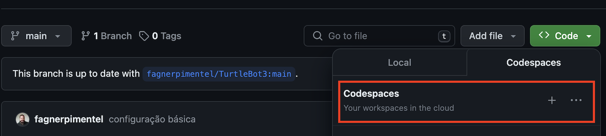
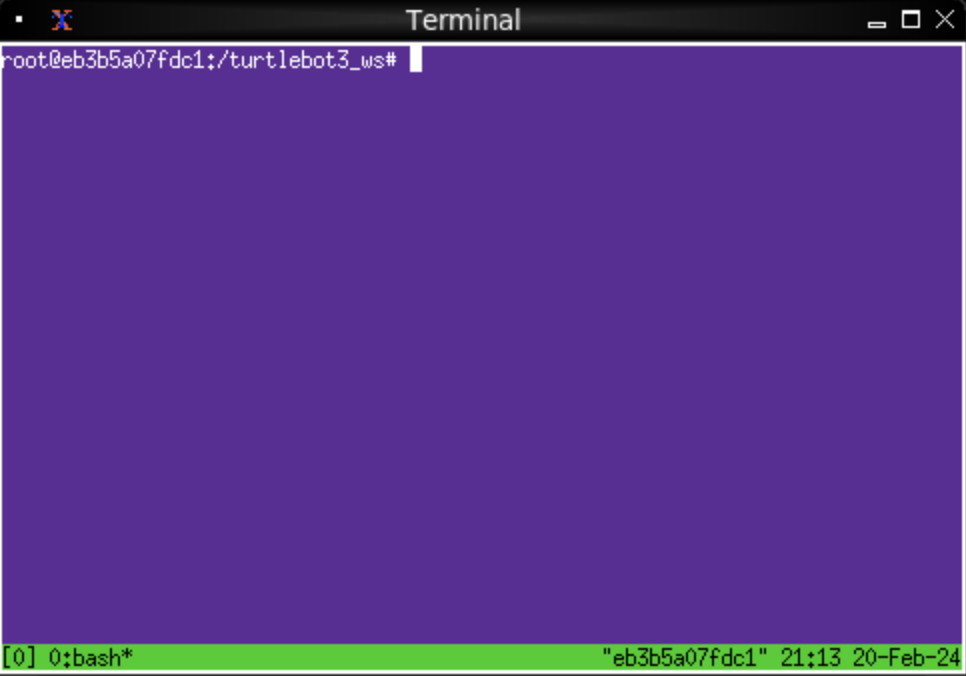
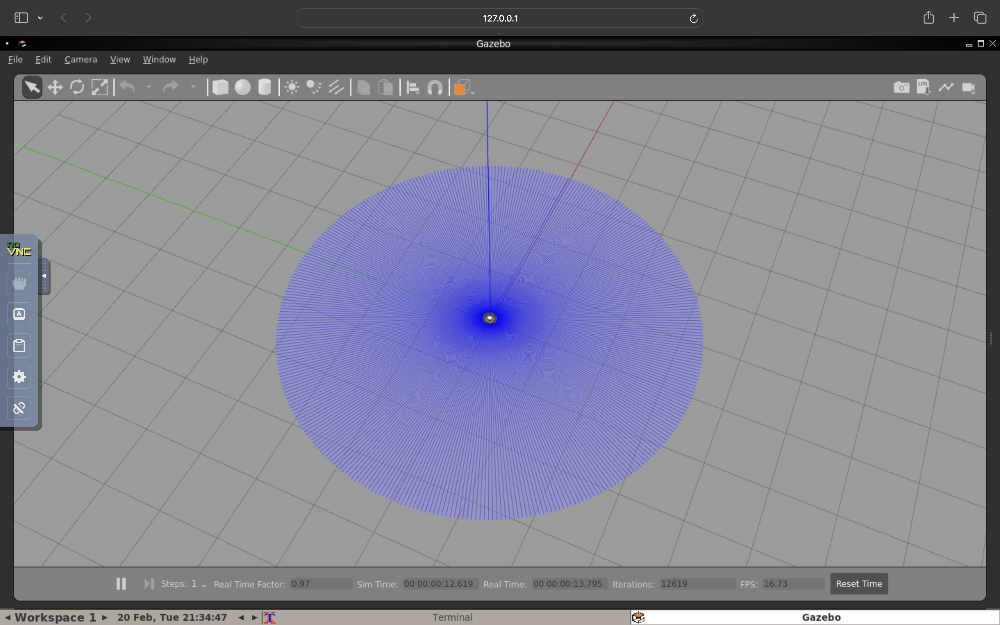
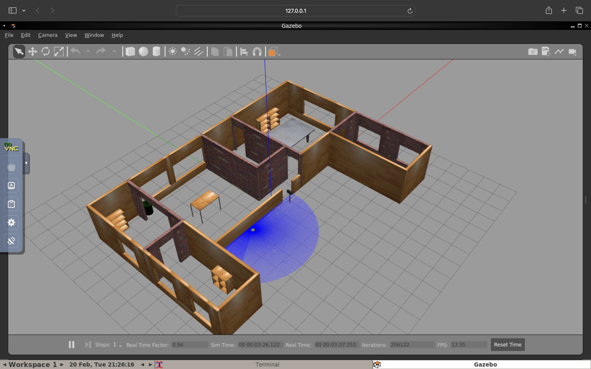
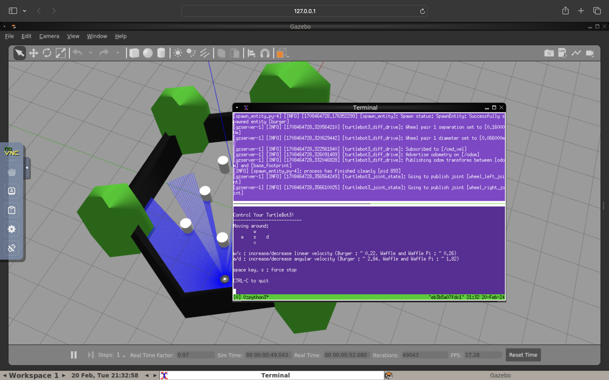

# TurtleBot3
Fork o repositorio clicando no icone `fork`.

Abra o projeto pelo `codespace`

<p align="center">
  
</p>

Criar ambiente virtual.
```bash
docker compose build
```

Executar no terminal para abrir o ambiente.
```bash
docker compose up ros-master
```

> Obs: CRTL + C para limpar o terminal

<p align="center">
  
</p>

**Dentro do ambiente executar os comandos abaixos para setup.**

> Obs: Não tem como copiar os comandos abaixos para o ambiente.

Para iniciar:
```bash
source /opt/ros/humble/setup.bash
```

<p align="center">
  
</p>

Setar variaveis de ambiente.
```bash
export ROS_DOMAIN_ID=30 
export TURTLEBOT3_MODEL=burger 
```

Iniciar simulador Gazebo sem robô:

```bash
ros2 launch turtlebot3_gazebo empty_world.launch.py
```

<p align="center">
  
</p>

Para iniciar a simulação com o robô:
```bash
ros2 launch turtlebot3_gazebo turtlebot3_house.launch.py
```

<p align="center">
  
</p>

Para dar comandos ao robô:
```bash
ros2 run turtlebot3_teleop teleop_keyboard
```

<p align="center">
  
</p>

Para abrir um segundo terminal:
